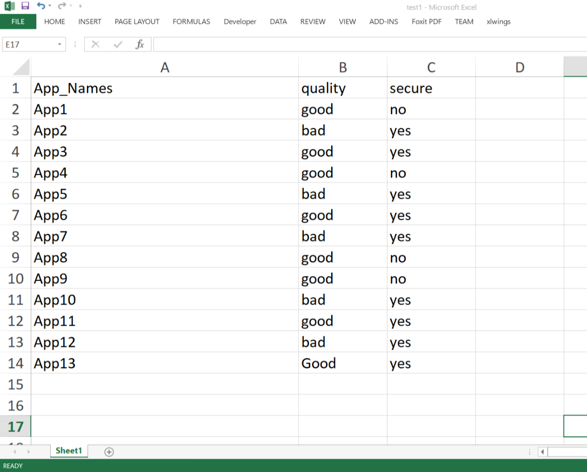
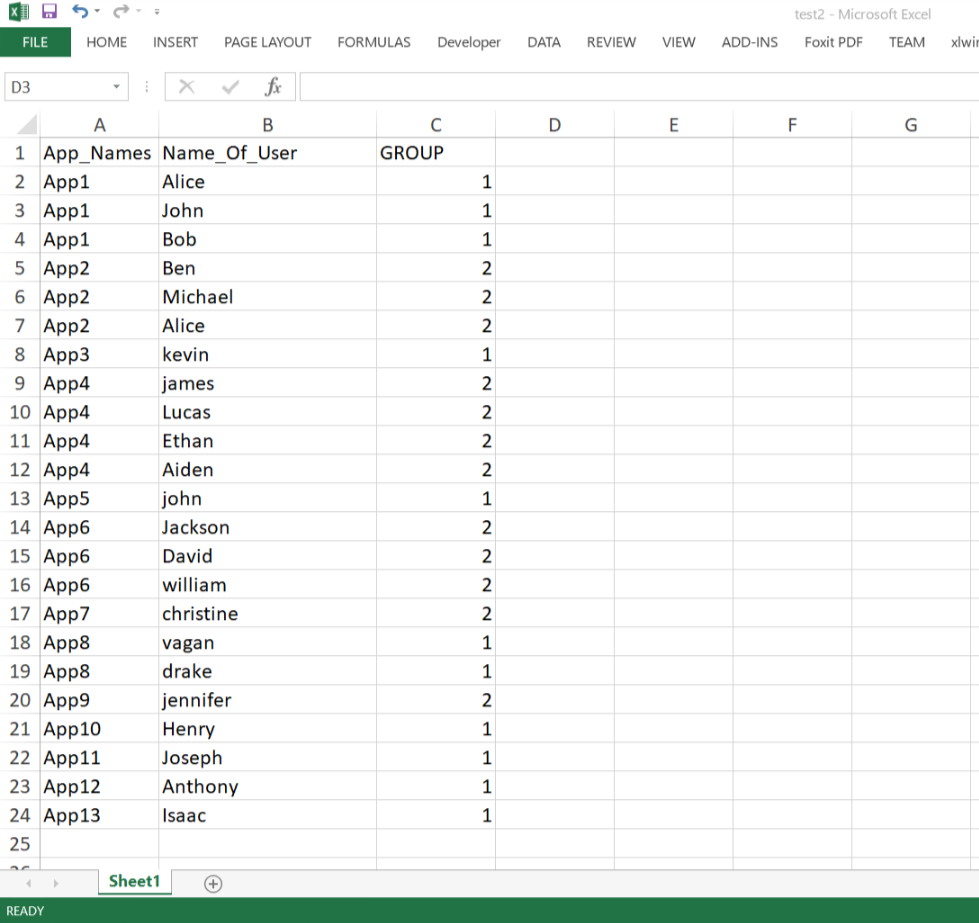
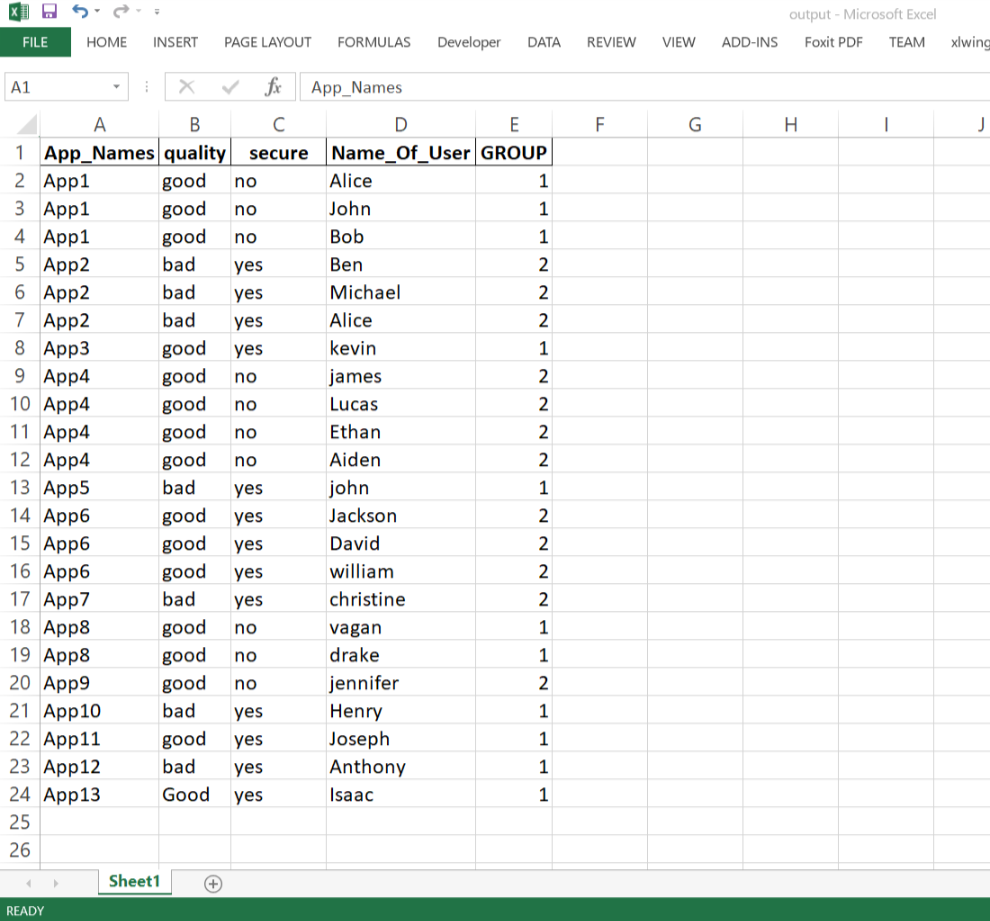

# work-10
Create a new report based on columns comparison from 2 excel sheets
* #### Test1 file:
<p align="left">
  
</p>

* #### Test2 file:
<p align="left">
  
</p>

## Installation
* Download and Install [Anaconda](https://www.anaconda.com/distribution/#download-section)
> NOTE: Don't forget to tick the checkbox corresponding to "Add to path". This will enable using `conda` in the terminal.
* Open the terminal and check for following packages
```
pandas
numpy
```
* If not found, then run these 2 commands in terminal:
	- `pip install pandas`
	- `pip install numpy`

## Coding
### Modules
* Import packages: Pandas, numpy
```py
import pandas as pd
import numpy as np
```
* Define dataframe - `df1`
```py
df1 = pd.ExcelFile("data/test1.xlsx").parse("Sheet1")
```
* Define dataframe - `df2`
```py
df2 = pd.ExcelFile("data/test2.xlsx").parse("Sheet1")
```
* Define dataframe - `df3`
```py
df3 = df2
```
* Insert 2 columns - `quality` & `secure` in `df3`
```py
df3.insert(1, column= "quality", value= np.nan)     # position 1: 2nd column
df3.insert(2, column= "secure", value= np.nan)      # position 2: 3rd column
```
* Run a rule in `df3` so that the corresponding values of columns - `quality` & `secure` is filled.
```py
# define 'App_Names' list for the `for` loop
list_app_names = df1['App_Names'].tolist()

"""
Description
===========
for loop introduced to apply the rules in the entire series ['App1', ......'App13'] 

For single `App1`:
------------------
df3.loc[df3.App_Names == 'App1', ['quality', 'secure']] = [df1.iloc[0,1], df1.iloc[0,2]]
"""
for i in range(len(list_app_names)):
    df3.loc[df3.App_Names == list_app_names[i], ['quality', 'secure']] = [df1.iloc[i,1], df1.iloc[i,2]]
```
* print the `df3` to a NEW `output.xlsx`
> NOTE: mark the index as `false`
```py
df3.to_excel("output.xlsx", index= False)
```

## Execution
There are 2 ways to run this:
* __M-1: Unix OS__ - run the [`run.sh`](./run.sh)
* __M-2: Windows OS__ - run the [`run.bat`](./run.bat)

## Output
<p align="left">
  
</p>
